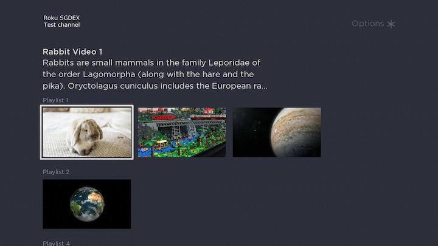
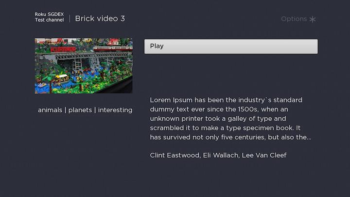
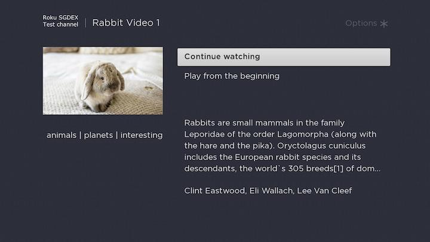

# Roku BrightScript SGDEX Test project

### Task
Implement video player with ability to add videos.

### User story
A user should be able to create a playlist, add videos to a playlist and play the videos
continuously or by choosing from the playlist.

### Details
- Create a simple form with artist, title and video url, which upon submitting would add
the selected video to the playlist.
- The video player should play continuously (when one video ends another one
begins, when the playlist reaches an end it starts from the beginning).
- Feel free to use any icons or fonts.
- No server implementation should be needed.
- Development time limit: 4h.

## Features
As soon as major functionality was implemented in 2 hours out of 4, more nice features were added.

**Required:**
- Playlists loading for Home screen;
- Videos loading for each playlist one by one in the background;
- Stream url loading just before playback;
- Video playback is continuous and cycled (first video is played after last ends);

**Additional:**
- Focus is moved to correct item in playlist when go back from details or playback;
- Bookmarks: there is a possibility to continue watching from last position;
- API communication module code is covered with Unit tests;
- App was prepared for publishing, packaged and deployed to Roku ChannelStore as Private channel;

**Version 1.1**
- Implemented possibility to add/remove items to My Playlist
- Added background video playback

## Publishing
The app was packaged and deployed to Roku ChannelStore it's available to download via
https://my.roku.com/account/add/6X265H2

## API
Despite no serverside implementation was required, tiny API was implemented for more fancy look.
### Add items to playlist or video API
*Disclaimer:* As soon as the task was related to Roku app development only, API was quickly developed for mock purposes. Major failures may occure at API side. 
```
curl --location --request POST 'https://sgdex.udesgo.com/playlist.php' \
--header 'Content-Type: application/javascript' \
--data-raw '{
	"title": "Playlist 3",
	"description": "Description",
	"poster_url": "https://dummyimage.com/640x360/44fff2/ffffff&text=Playlist+3"
}'

curl --location --request POST 'https://sgdex.udesgo.com/video.php' \
--header 'Content-Type: application/javascript' \
--data-raw '{
    "title": "Video 3",
    "description": "Description",
    "poster_url": "https://dummyimage.com/640x360/44fff2/ffffff&text=Video+3",
    "stream_url": "https://file-examples.com/wp-content/uploads/2017/04/file_example_MP4_1920_18MG.mp4",
    "playlist_id": "6"
}'
```

## Screenshots





